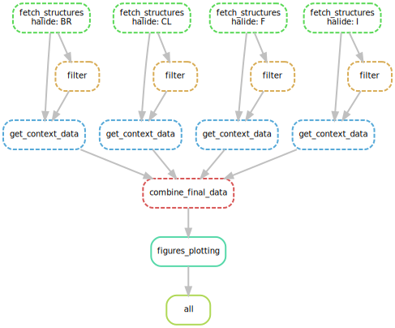

# Halide sites  
## Dependencies
You should install it manually:
* [Freesasa](https://www.ncbi.nlm.nih.gov/pmc/articles/PMC4776673/)  
* [Anaconda](https://www.digitalocean.com/community/tutorials/how-to-install-anaconda-on-ubuntu-18-04-quickstart)  
## Preparation  
Create your conda environment from our smk.yml  
```
conda env create -f smk.yml --name smk
```
Activate your environment (some of this should work)  
```
conda activate smk
```
or
```
source activate smk
```

Make sure everything works on `--dryrun`.
```
snakemake all -n
```
## How to use
```
snakemake all
```
## DAG of jobs  

